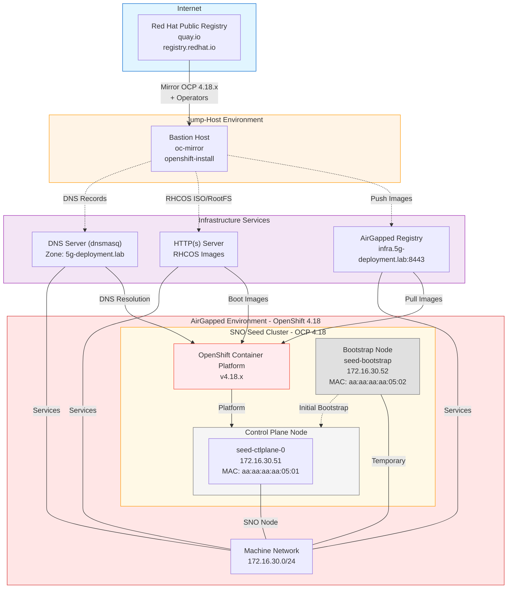

# SNO Seed Cluster - Single Node OpenShift

This repository contains the configuration and deployment automation for the **seed** Single Node OpenShift (SNO) cluster in the 5g-deployment.lab environment.

> [!CAUTION]
> Unless specified otherwise, everything contained in this repository is unsupported by Red Hat.

[](https://github.com/midu16/sno-seed.5g-deployment.lab/actions/workflows/deploy-sno-seed.yml)

## Table of Contents
- [SNO Seed Cluster - Single Node OpenShift](#sno-seed-cluster---single-node-openshift)
  - [Table of Contents](#table-of-contents)
  - [Cluster Overview](#cluster-overview)
  - [Network Configuration](#network-configuration)
  - [High Level Architecture](#high-level-architecture)
  - [Prerequisites](#prerequisites)
  - [Mirror to AirGapped Registry](#mirror-to-airgapped-registry)
  - [Preparing the Installation](#preparing-the-installation)
  - [Start the Installation](#start-the-installation)
  - [Post-Installation](#post-installation)

## Cluster Overview

- **Cluster Name**: seed
- **Base Domain**: 5g-deployment.lab
- **Cluster Type**: Single Node OpenShift (SNO)
- **OpenShift Version**: 4.18.x
- **Platform**: Bare Metal / KVM

## Network Configuration

Based on the dnsmasq configuration, the cluster uses the following network settings:

| Component | FQDN | IP Address | MAC Address |
|-----------|------|------------|-------------|
| API (Internal) | api-int.seed.5g-deployment.lab | 172.16.30.50 | - |
| API (External) | api.seed.5g-deployment.lab | 172.16.30.50 | - |
| Apps Wildcard | *.apps.seed.5g-deployment.lab | 172.16.30.50 | - |
| Control Plane | seed-ctlplane-0 | 172.16.30.51 | aa:aa:aa:aa:05:01 |
| Bootstrap | seed-bootstrap | 172.16.30.52 | aa:aa:aa:aa:05:02 |

**Network Details:**
- Machine Network: 172.16.30.0/24
- Gateway: 172.16.30.1
- DNS Server: 172.16.30.1
- Cluster Network: 172.21.0.0/16
- Service Network: 172.22.0.0/16

## High Level Architecture



## Prerequisites

1. **Infrastructure Services Ready:**
   - DNS Server (dnsmasq) configured with the records shown above
   - AirGapped Registry at infra.5g-deployment.lab:8443
   - HTTP Server for RHCOS images
   - KVM/Libvirt host for VM creation

2. **Required Tools:**
   - `oc-mirror` (for mirroring images) - downloaded via `00_client_download.sh`
   - `oc` and `kubectl` (OpenShift client tools) - downloaded via `00_client_download.sh`
   - `openshift-install` (for generating installation artifacts) - extracted from release image
   - `kcli` (for VM management)
   - `make` (for automation)

3. **Secrets and Certificates:**
   - Pull secret for the AirGapped registry
   - SSH public key
   - Registry CA certificate

## Mirror to AirGapped Registry

1. Clone this repository:

```bash
git clone git@github.com:midu16/sno-seed.5g-deployment.lab.git
cd sno-seed.5g-deployment.lab/
```

2. **Configure Deployment Type and Version**:

The repository supports two deployment types:

**GA (General Availability)** - Production deployments
```bash
# Edit VERSION file
echo "DEPLOYMENT_TYPE=ga" > VERSION
echo "OCP_VERSION=4.18.27" >> VERSION
```

**PreGA (Pre-General Availability)** - Testing upcoming releases
```bash
# Edit VERSION file
echo "DEPLOYMENT_TYPE=prega" > VERSION
echo "OCP_VERSION=4.22.0" >> VERSION
```

The VERSION file is used by:
- Makefile targets
- Download scripts (00_client_download.sh)
- ImageSet configuration generation
- GitHub Actions workflow

You can also override by setting environment variables:
```bash
export DEPLOYMENT_TYPE=ga
export OCP_VERSION=4.18.27
```

3. Download the OpenShift client tools (oc, kubectl, oc-mirror):

**Option A: Using the download script (reads from VERSION file)**
```bash
./00_client_download.sh
# Or specify version: ./00_client_download.sh -v 4.18.27
```

**Option B: Using Make (reads from VERSION file)**
```bash
make download-oc-tools
# Or specify version: make download-oc-tools VERSION=4.18.27
```

Both methods will install the tools to `./bin/` directory.

4. Generate the `imageset-config.yml`:

**For GA deployment:**
```bash
make imageset-ga
# Or specify version: make imageset-ga VERSION=4.18.27
```

**For PreGA deployment:**
```bash
make imageset-prega
# Or specify version: make imageset-prega VERSION=4.22.0
```

**Direct script usage:**
```bash
# GA deployment
./generate-imageset-dynamic.sh --ga 4.18.27

# PreGA deployment
./generate-imageset-dynamic.sh --prega 4.22.0

# With debug output (shows channel discovery process)
./generate-imageset-dynamic.sh --prega 4.22.0 -d
```

This will generate `imageset-config.yml` with:
- **GA**: `registry.redhat.io/redhat/redhat-operator-index:v4.18`
- **PreGA**: `quay.io/prega/prega-operator-index:v4.22`
- Static operator list (7 operators)
- **Dynamically discovered channels** using `oc-mirror list operators`

> **Note:** Operator channels are automatically discovered from the catalog index. If `oc-mirror` is not available, the script falls back to sensible defaults. See [Dynamic Channel Discovery](docs/dynamic-channel-discovery.md) for details.

5. Mirror content to AirGapped Registry:

```bash
./bin/oc-mirror -c imageset-config.yml --v2 --workspace file://seed/ \
  docker://infra.5g-deployment.lab:8443/seed \
  --max-nested-paths 10 \
  --parallel-images 10 \
  --parallel-layers 10 \
  --dest-tls-verify=false \
  --log-level debug
```

6. Review the generated cluster resources:

```bash
tree seed/working-dir/cluster-resources/

seed/working-dir/cluster-resources/
├── cc-redhat-operator-index-v4-18.yaml
├── cs-redhat-operator-index-v4-18.yaml
├── idms-oc-mirror.yaml
├── itms-oc-mirror.yaml
├── signature-configmap.json
├── signature-configmap.yaml
└── updateService.yaml
```

## Preparing the Installation

1. **Configure the working directory:**

The `workingdir/` contains the base configuration:

```bash
tree workingdir/

workingdir/
├── agent-config.yaml
├── install-config.yaml
└── openshift/
    ├── catalogSource-cs-redhat-operator-index.yaml
    ├── disable-operatorhub.yaml
    └── idms-oc-mirror.yaml
```

2. **Customize the `install-config.yaml` with secrets:**

```bash
# Fetch registry certificate
make fetch-certificate

# Generate registry pull secret
make registry-pull-secret USERNAME=<user> PASSWORD=<password>

# Update SSH key
make update-sshkey SSHKEY_FILE=${HOME}/.ssh/id_rsa.pub
```

3. **Generate the `openshift-install` binary:**

```bash
make generate-openshift-install \
  RELEASE_IMAGE=infra.5g-deployment.lab:8443/seed/openshift/release-images:4.18.27-x86_64
```

4. **Generate the `agent.iso` file:**

```bash
./bin/openshift-install agent create image --dir ./seed/

# Copy to HTTP server
cp seed/agent.x86_64.iso /opt/webcache/data/agent.x86_64.iso
```

5. **Create the SNO VM:**

```bash
kcli create vm \
  -P start=True \
  -P uefi_legacy=true \
  -P plan=sno-seed \
  -P memory=32768 \
  -P numcpus=16 \
  -P disks=[120,50] \
  -P nets='[{"name": "br0", "mac": "aa:aa:aa:aa:05:01"}]' \
  -P uuid=aaaaaaaa-aaaa-aaaa-aaaa-aaaaaaaa0501 \
  -P name=seed-ctlplane-0 \
  -P iso=/opt/webcache/data/agent.x86_64.iso
```

> [!NOTE]
> To clean up the SNO VM:
> ```bash
> kcli delete plan sno-seed -y
> ```

## Start the Installation

1. **Monitor the installation progress:**

```bash
./bin/openshift-install --dir ./seed/ agent wait-for install-complete --log-level=info

INFO Waiting for cluster install to initialize. Sleeping for 30 seconds
INFO Waiting for cluster install to initialize. Sleeping for 30 seconds
INFO Bootstrap Kube API Initialized
INFO Bootstrap configMap status is complete
INFO Cluster is installed
INFO Install complete!
INFO To access the cluster as the system:admin user when using 'oc', run
INFO     export KUBECONFIG=/home/midu/sno-seed.5g-deployment.lab/seed/auth/kubeconfig
INFO Access the OpenShift web-console here: https://console-openshift-console.apps.seed.5g-deployment.lab
INFO Login to the console with user: "kubeadmin", and password: "<generated-password>"
```

2. **Access the cluster:**

```bash
export KUBECONFIG=./seed/auth/kubeconfig
oc get nodes
oc get clusterversion
```

## Included Operators

The imageset-config.sh template includes the following Day-2 operators:

| Operator | Description |
|----------|-------------|
| **sriov-network-operator** | SR-IOV Network Operator for high-performance networking |
| **local-storage-operator** | Local Storage Operator for local persistent volumes |
| **lvms-operator** | LVM Storage for dynamic volume provisioning |
| **cluster-logging** | Cluster Logging for centralized log aggregation |
| **ptp-operator** | Precision Time Protocol for time synchronization |
| **lifecycle-agent** | Image-Based Lifecycle Manager for upgrades |
| **oadp-operator** | OpenShift API for Data Protection (backup/restore) |

## Post-Installation

After successful installation, you can:

1. **Apply Day-2 configurations:**
   - Configure mirrored operators (already available)
   - Set up monitoring and alerting
   - Configure storage classes (LVM/Local Storage)
   - Apply security policies

2. **Verify cluster health:**

```bash
oc get co  # Check cluster operators
oc get nodes  # Verify node status
oc get clusterversion  # Check cluster version
```

3. **Install Day-2 Operators:**
   All operators are already mirrored and available in the disconnected catalog.

## Documentation

- **[Deployment Types (GA vs PreGA)](./docs/deployment-types.md)** - Complete guide for GA and PreGA deployments
- **[ImageSet Configuration Guide](./docs/imageset-config-guide.md)** - Detailed guide for generating imageset configs
- **[Quick Start Guide](./QUICKSTART.md)** - Fast deployment walkthrough
- **[Contributing Guide](./CONTRIBUTING.md)** - Contribution guidelines

---

**References:**
- Based on [l1-cp framework](https://github.com/midu16/l1-cp)
- OpenShift Documentation: https://docs.openshift.com/
- SNO Deployment Guide: https://docs.openshift.com/container-platform/latest/installing/installing_sno/install-sno-installing-sno.html
